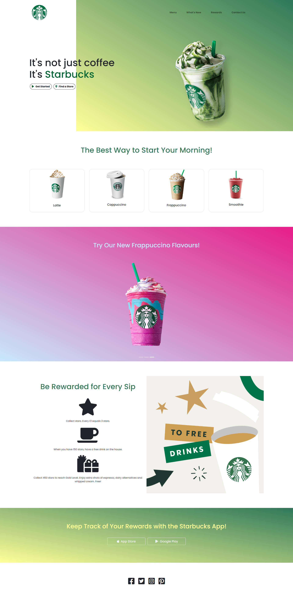

## Overview

## Table of contents

- [Overview](#overview)
  - [The Project](#the-project)
  - [Screenshot](#screenshot)
  - [Links](#links)
- [My process](#my-process)
  - [Built with](#built-with)
  - [What I learned](#what-i-learned)
  - [Continued development](#continued-development)

### The Project

The aim of this project was to create a visually appealing webpage with a Starbucks theme. The focus was on honing my skills with HTML and CSS as well as 
utilising Bootstrap to achieve a responsive design and implement other features such as a navbar and carousel.

## Screenshot



### Links

- Live Site URL: https://aidenm99.github.io/Starbucks-Project/

### Built with

- HTML
- CSS
- Bootstrap

### What I learned

- How to implement gradients 

```css
background-image:linear-gradient(to left bottom, #2e7858, #ffff99);
```

- A way of selecting a specific item when there are multiple of them

```css
#intro .container-fluid {
}
```

- How to add a navbar using Bootstrap

```html
    <div class="container-fluid intro">
      <nav class="navbar navbar-expand-lg navbar-light">
        <a class="navbar-brand" href="#"></a>
        <button class="navbar-toggler" type="button" data-toggle="collapse" data-target="#navbarSupportedContent" aria-controls="navbarSupportedContent" aria-expanded="false" aria-label="Toggle navigation">
          <span class="navbar-toggler-icon"></span>
        </button>

        <div class="collapse navbar-collapse" id="navbarSupportedContent">
          <ul class="navbar-nav ml-auto mr-5">
            <li class="nav-item mr-5">
              <a class="nav-link" href="#menu">Menu</a>
            </li>
            <li class="nav-item mr-5">
              <a class="nav-link" href="#carousel">What's New</a>
            </li>
            <li class="nav-item mr-5">
              <a class="nav-link" href="#rewards">Rewards</a>
            </li>
            <li class="nav-item mr-5">
              <a class="nav-link" href="#social-media">Contact Us</a>
            </li>
          </ul>
        </div>
      </nav>
```

- How to add a carousel using Bootstrap

```html
  <section id="carousel">
    <div id="carouselExampleSlidesOnly" class="carousel slide" data-ride="carousel" data-interval="5000">
      <div id="carouselExampleIndicators" class="carousel slide" data-ride="carousel">
        <ol class="carousel-indicators">
          <li data-target="#carouselExampleIndicators" data-slide-to="0" class="active"></li>
          <li data-target="#carouselExampleIndicators" data-slide-to="1"></li>
          <li data-target="#carouselExampleIndicators" data-slide-to="2"></li>
        </ol>
        <div class="carousel-inner">
          <div class="carousel-item one active container-fluid">
            <h3 class="frappuccino-heading green"> Try Our New Frappuccino Flavours!</h3>
            
          </div>
          <div class="carousel-item two container-fluid">
            <h3 class="frappuccino-heading peach"> Try Our New Frappuccino Flavours!</h3>
            
          </div>
          <div class="carousel-item three container-fluid">
            <h3 class="frappuccino-heading pink"> Try Our New Frappuccino Flavours!</h3>
            
          </div>
        </div>
      </div>
  </section>
```

### Continued Development

- I plan to continue honing my skills with Bootstrap and utilise more of its features to create more appealing and modern webpages. 
